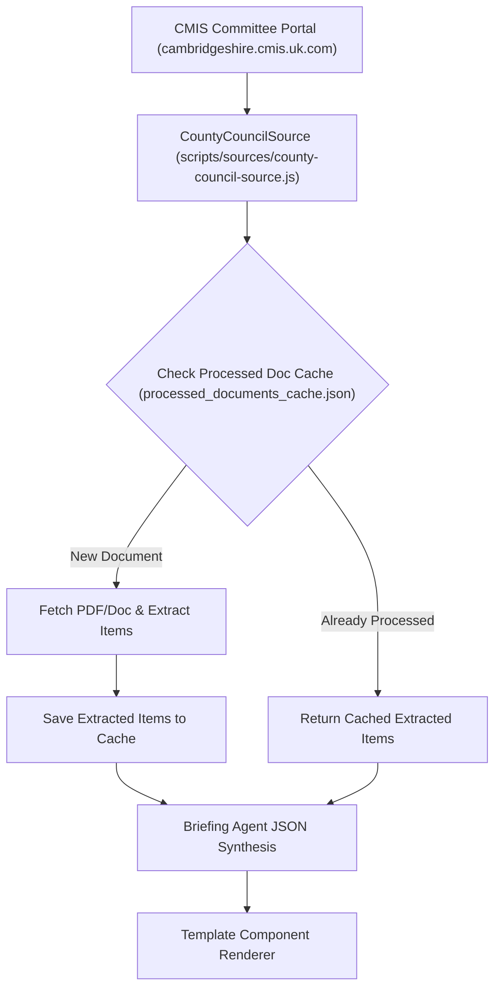

# Implementation Plan: Cambridgeshire County Council Ingestion & Persistent Document Processing Cache

## Goal & Background Context
We want to expand the **Governance & Parish Council** block of our Village Daily Briefing System by integrating meeting minutes, agendas, and decision statements from **Cambridgeshire County Council**, while establishing a **Persistent Document Processing Cache** to avoid re-processing identical documents or repeating LLM extraction calls on daily runs.

We have discovered the official live portal:
- **Cambridgeshire CMIS Portal**: `https://cambridgeshire.cmis.uk.com/ccc_live/`
- **Key Committees**:
  1. **County Council (Full Council)** (`id/20`)
  2. **Highways & Transport Committee** (`id/62`)
  3. **Environment & Green Investment Committee** (`id/67`)
  4. **Children & Young People Committee** (`id/4`)
  5. **Strategy, Resources & Performance Committee** (`id/71`)

---

## User Review Required

> [!IMPORTANT]
> **Persistent Document Processing Cache (`src/_data/processed_documents_cache.json`)**
> Every document URL (PDF/DOCX/CMIS Decision Pack) that is fetched and extracted will be saved in `src/_data/processed_documents_cache.json`. Subsequent daily runs check this cache first, instantly retrieving already-extracted structured items without re-downloading, unzipping, or invoking duplicate LLM calls.

> [!IMPORTANT]
> **Local Relevance Filtering**
> County Council items will be strictly filtered for relevance to **Warboys**, **Huntingdonshire**, **B1040/A141 roads**, **SEND/schools**, or county-wide infrastructure policies.

---

## Proposed Changes



### 1. Document Processing Cache Module
#### `[NEW] scripts/utils/processed-doc-cache.js`
- Manages reading/writing `src/_data/processed_documents_cache.json`.
- `getCachedDocument(docUrl)`: Returns cached extracted items if present.
- `setCachedDocument(docUrl, extractedItems)`: Stores extracted JSON items with ISO timestamp.

### 2. New Source Extractor: `CountyCouncilSource`
#### `[NEW] scripts/sources/county-council-source.js`
- Inherits from `BaseSource`.
- Queries CMIS portal (`https://cambridgeshire.cmis.uk.com/ccc_live/`) for upcoming and recent committee meetings.
- Uses `processed-doc-cache.js` before fetching document packs.
- Filters for local terms: `Warboys`, `Huntingdonshire`, `HDC`, `A141`, `B1040`, `SEND`, `Highways`, `Bus`, `School`.

### 3. Integrated Document Caching in `docx-parser.js` & `parish-council-source.js`
#### `[MODIFY] scripts/utils/docx-parser.js`
- Integrates `processed-doc-cache.js` so Parish Council DOCX meeting minutes are also cached persistently.

### 4. Configuration & Pipeline
#### `[MODIFY] village.config.json`
- Add `county-council` source entry pointing to `https://cambridgeshire.cmis.uk.com/ccc_live/`.

#### `[MODIFY] scripts/ingest.js`
- Register `CountyCouncilSource` in the ingestion pipeline.

---

## Verification Plan

### Automated Tests
1. **Unit Test Suite**: Update `tests/regression-suite.test.js`:
   - Verify `processed-doc-cache.js` correctly saves and retrieves cached document items.
   - Verify `CountyCouncilSource` extracts meetings and document links from CMIS portal HTML.
   - Verify duplicate runs make zero network/parser calls for cached documents.
2. **Regression Command**:
   ```bash
   npm test
   ```

### Manual Verification
1. Run local ingestion in mock & live modes:
   ```bash
   npm run ingest:mock && npm run build
   ```
2. Inspect `src/_data/processed_documents_cache.json` to confirm document items are stored.
3. Re-run `npm run ingest:mock`: Verify that ingestion completes instantly using cached document data.
