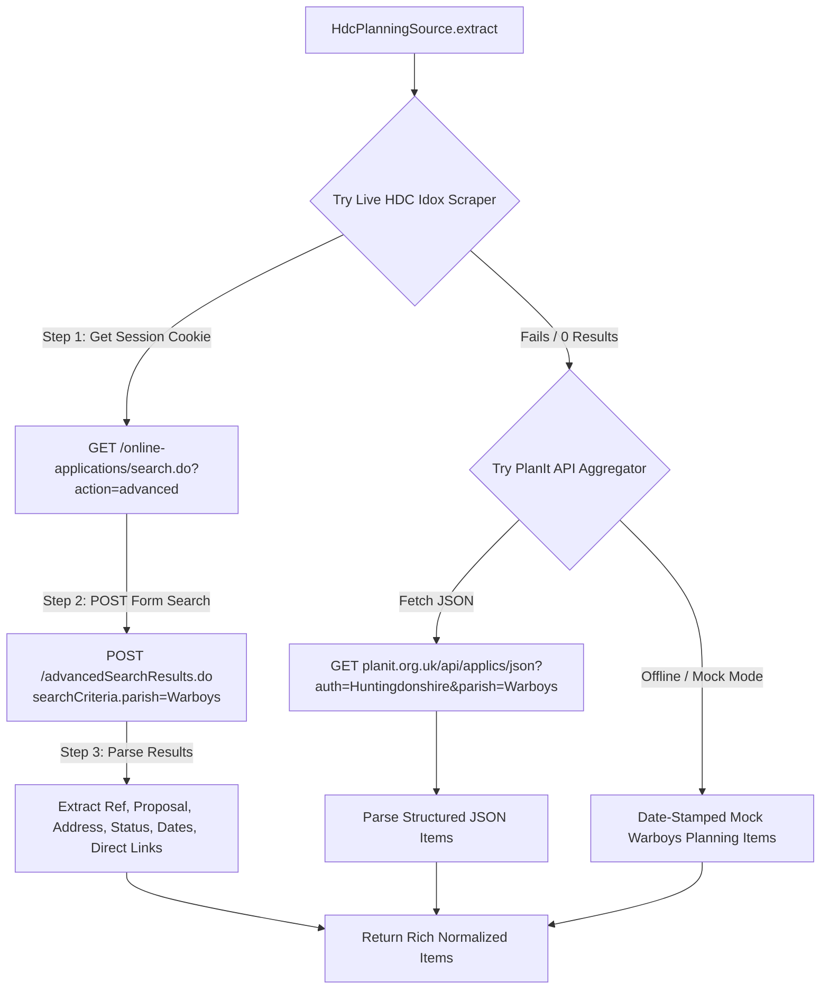

# Implementation Plan: HDC Planning Module Upgrade

Analyze and enhance the **Huntingdonshire District Council (HDC) Planning Module** (`scripts/sources/hdc-planning-source.js`).

---

## How It Currently Works

### 1. Endpoint & Fetching
- Currently executes a simple `fetch()` GET request to HDC's static weekly list URL:
  `https://publicaccess.huntingdonshire.gov.uk/online-applications/search.do?action=weeklyList`

### 2. HTML Parsing & Filtering
- Scrapes elements matching CSS selector `.searchresult`.
- Extracts `title` from `<a>` link and `address` from `.address`.
- Applies a simple string `.includes('Warboys')` check on title/address.

### 3. Current Limitations
- **Session Dependency**: Idox PublicAccess portals require session cookies (`JSESSIONID`) and form parameters (`searchCriteria.parish=Warboys`) to perform search queries. A plain GET request to `/weeklyList` without session state often redirects or returns 0 items.
- **Unstructured Output**: Does not parse application reference numbers (e.g. `26/00142/FUL`), detailed proposal text, decision status (*Under Consultation*, *Awaiting Decision*, *Permitted*), or registration dates.
- **No Live Secondary Source**: If HDC is offline for nightly maintenance (10 PM - 1 AM), it has no live API fallback.

---

## Proposed Upgraded Architecture

---

## Proposed Changes

### 1. Ingestion Source (`scripts/sources/hdc-planning-source.js`)

#### `[MODIFY]` `hdc-planning-source.js`
- **Session & Form POST Handling**:
  - Perform GET request to obtain session cookies (`JSESSIONID`).
  - Submit form search with `searchCriteria.parish=Warboys&dateType=APPLICATION_VALID`.
- **Rich Cheerio Selectors**:
  - Parse Application Reference Number (e.g., `26/00142/FUL`).
  - Parse Site Address & Proposal Description.
  - Parse Application Status (*Awaiting Decision*, *Permitted*, *Under Consultation*).
  - Parse direct link to application summary page.
- **PlanIt API Integration**:
  - Secondary fallback querying `https://www.planit.org.uk/api/applics/json` for Huntingdonshire / Warboys applications.
- **Enhanced Mock Items**:
  - Realistic current-year Warboys planning applications for dry-runs.

---

## Verification Plan

### Automated Tests & Pipeline Checks
1. `npm run test:sources`: Verify HDC planning extractor parses fields cleanly.
2. `npm run ingest:mock`: Verify LLM briefing generation with rich planning metadata.
3. `npm run build`: Verify 11ty generates `/archive/YYYY-MM-DD/sources/` with rich planning breakdown.
