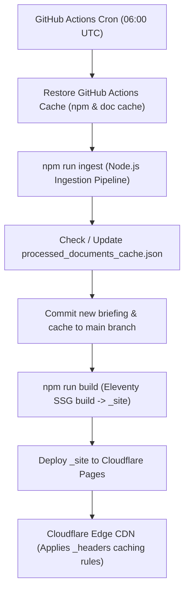

# Implementation Plan: Cloudflare Pages Hosting & Multi-Tier Data Caching Strategy

Design and configure an automated build, deployment, and data caching architecture for **Village Daily Briefing** hosted on **Cloudflare Pages** via a **GitHub Repository**.

---

## 🎯 Goal & Architecture Overview

The system requires:
1. **Automated Daily Content Ingestion**: Running the Node.js agent pipeline (`npm run ingest`) at 06:00 AM UTC daily via GitHub Actions.
2. **Persistent Document & Summary Caching**: Maximizing data caching across pipeline runs to eliminate redundant LLM API costs and unnecessary re-downloads of DOCX minutes and Sway newsletters.
3. **Automated Deployment**: Building the static Eleventy site (`npm run build`) and deploying `_site` to **Cloudflare Pages**.
4. **Cloudflare Edge CDN Caching**: Setting Cloudflare `_headers` rules to optimize browser & edge CDN caching for static assets, HTML briefings, iCalendar feeds (`.ics`), and RSS feeds (`.xml`).



---

## ⚠️ User Review Required

> [!IMPORTANT]
> **GitHub Secrets Setup Required**:
> To deploy automatically via GitHub Actions to Cloudflare Pages, the following secrets must be set in your GitHub repository (`Settings -> Secrets and variables -> Actions`):
> 1. `LLM_API_KEY`: Your Gemini or OpenAI API Key.
> 2. `CLOUDFLARE_API_TOKEN`: Cloudflare API Token (with `Cloudflare Pages: Edit` permissions).
> 3. `CLOUDFLARE_ACCOUNT_ID`: Your Cloudflare Account ID.

> [!NOTE]
> **Data Caching Persistence**:
> We implement a two-pronged caching strategy:
> 1. **Repository & Action Cache**: `src/_data/processed_documents_cache.json` is committed back to `main` upon new briefings AND cached using `actions/cache@v4` in GitHub Actions.
> 2. **HTTP Edge Cache (`_headers`)**: Cloudflare edge cache rules defined in `src/public/_headers` (copied directly into `_site/_headers` by Eleventy).

---

## 🛠️ Proposed Changes

### 1. Cloudflare Edge Caching Headers (`src/public/_headers`)

#### [NEW] `src/public/_headers`
Create Cloudflare Pages `_headers` configuration to enforce edge and browser caching policies:

```http
# Static CSS and assets - long term immutable cache (1 year)
/public/*
  Cache-Control: public, max-age=31536000, immutable

# Daily briefing pages & archive - cache at edge for 1 day, browser for 1 hour
/
  Cache-Control: public, max-age=3600, s-maxage=86400, stale-while-revalidate=604800
/wpa/
  Cache-Control: public, max-age=3600, s-maxage=86400, stale-while-revalidate=604800
/calendar/
  Cache-Control: public, max-age=3600, s-maxage=86400, stale-while-revalidate=604800
/archive/*
  Cache-Control: public, max-age=86400, s-maxage=604800, immutable

# iCalendar feeds - fast refresh (30 min browser, 1 hour CDN edge)
/*.ics
  Cache-Control: public, max-age=1800, s-maxage=3600, stale-while-revalidate=86400
  Content-Type: text/calendar; charset=utf-8
  Access-Control-Allow-Origin: *

# RSS feed - 30 min refresh
/feed.xml
  Cache-Control: public, max-age=1800, s-maxage=3600
  Content-Type: application/xml; charset=utf-8
```

---

### 2. Update Eleventy Passthrough Copy ([`.eleventy.js`](file:///home/dsample/code/village-daily/.eleventy.js))

#### [MODIFY] `.eleventy.js`
Ensure `src/public/_headers` is copied directly to `_site/_headers` during SSG build:

```diff
 module.exports = function(eleventyConfig) {
   // Passthrough static CSS / assets
   eleventyConfig.addPassthroughCopy({ "src/public": "public" });
+  eleventyConfig.addPassthroughCopy({ "src/public/_headers": "_headers" });
```

---

### 3. Enhance GitHub Actions Workflow ([`.github/workflows/daily-briefing.yml`](file:///home/dsample/code/village-daily/.github/workflows/daily-briefing.yml))

#### [MODIFY] `.github/workflows/daily-briefing.yml`
Update GitHub Actions to cache `processed_documents_cache.json` across workflow runs and commit both briefings and updated document caches back to git:

```yaml
name: Daily Briefing Generator & Cloudflare Deploy

on:
  schedule:
    - cron: '0 6 * * *' # Run daily at 06:00 AM UTC
  workflow_dispatch: # Allow manual trigger

jobs:
  build-and-deploy:
    runs-on: ubuntu-latest
    steps:
      - name: Checkout Repository
        uses: actions/checkout@v4

      - name: Setup Node.js
        uses: actions/setup-node@v4
        with:
          node-version: '20'
          cache: 'npm'

      - name: Restore Processed Document Cache
        uses: actions/cache@v4
        with:
          path: src/_data/processed_documents_cache.json
          key: doc-cache-${{ runner.os }}-${{ github.run_id }}
          restore-keys: |
            doc-cache-${{ runner.os }}-

      - name: Install Dependencies
        run: npm ci

      - name: Run Data Ingestion & Briefing Agent
        env:
          LLM_API_KEY: ${{ secrets.LLM_API_KEY || secrets.GEMINI_API_KEY }}
          LLM_MODEL: ${{ secrets.LLM_MODEL || 'gemini-2.5-flash' }}
        run: npm run ingest

      - name: Commit New Briefing & Cache Updates
        uses: stefanzweifel/git-auto-commit-action@v5
        with:
          commit_message: "chrono: daily briefing & updated document cache"
          file_pattern: "src/briefings/*.md src/_data/daily_sources/*.json src/_data/processed_documents_cache.json"

      - name: Build Eleventy Static Site
        run: npm run build

      - name: Deploy to Cloudflare Pages
        uses: cloudflare/pages-action@v1
        with:
          apiToken: ${{ secrets.CLOUDFLARE_API_TOKEN }}
          accountId: ${{ secrets.CLOUDFLARE_ACCOUNT_ID }}
          projectName: 'village-daily'
          directory: '_site'
          gitToPages: false
```

---

## 🧪 Verification Plan

### Automated Tests
- Run `npm test` to verify zero regression across parsing, iCal generation, and pre-filtering logic.
- Run `npm run ingest:mock && npm run build` to verify that `_site/_headers` is correctly generated and placed in `_site/`.

### Manual Verification
- Check `_site/_headers` file content to verify cache-control rules.
- Push changes and verify GitHub Actions syntax using `git diff` and local build checks.
