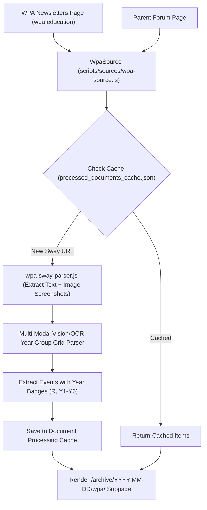

# Implementation Plan: Warboys Primary Academy (WPA) Subpage & Sway OCR Extractor

## Document Analysis & Live Research Summary
We analyzed real live documents from Warboys Primary Academy:
1. **WPA Newsletters Page** (`https://www.wpa.education/parents/letters-newsletters`)
   - Links to Microsoft Sway weekly newsletters (e.g. `https://sway.cloud.microsoft/MLTtAeuJheXv3QNm?ref=Link`).
2. **Analyzed Sway Newsletter Content** (*WPA Weekly News - Thursday 16th July 2026*):
   - **Headteacher / End-of-Year Update**: Year 6 *Oliver!* performance, Achievement Assembly, Reception Teddy Bears' Picnic, Year 6 cinema trip, return date **Thursday 3rd September 2026**.
   - **Attendance Policy Changes (Sept 2026)**: Optician appointments no longer authorized; launch of Termly Attendance Pizza Parties (TAPP) for 98%+ attendance.
   - **PTFA Uniform**: Pre-loved uniform sales on Facebook.
   - **YDP Sports Camps**: Summer sports camps (£25/day or £100/week) with free places for FSM eligible pupils.
   - **Safeguarding Emergency Contacts**: `safeguarding@wpa.education`, 0345 045 5203, 101, 999.
3. **"Dates for Your Diary" Screenshot Image Parsing**:
   - Sway embeds image screenshots for diary spreadsheet tables.
   - Spreadsheet columns cover **R (Reception)** and **Years 1–6** with color highlights indicating targeted year groups and green text for newly added entries.
4. **Parent Forum Page** (`https://www.wpa.education/parents/parent-forum`):
   - Contains meeting dates (e.g. 20th November 2025), agendas, parent feedback topics, class ambassadors, and direct contact email (`parentforum@wpa.education`).

---

## Proposed Architecture



---

## User Review Required

> [!IMPORTANT]
> **Dedicated WPA Subpage (`/archive/YYYY-MM-DD/wpa/`)**
> The subpage template `src/archive/wpa.njk` will be generated for every daily briefing run. A prominent top-level callout banner will link to it from the main daily briefing.
>
> Components on the WPA Subpage:
> 1. 🎓 **Academy News & Announcements** (Headteacher update, attendance changes, PTFA, YDP camps)
> 2. 📅 **Dates for Your Diary** (Structured events with year group badges: `R`, `Y1`, `Y2`, `Y3`, `Y4`, `Y5`, `Y6`, `All Years`)
> 3. 💬 **Parent Forum Discussions & Class Ambassadors**
> 4. 🔗 **Direct Microsoft Sway & Document Links**

> [!NOTE]
> **Vision/OCR Spreadsheet Image Parser**
> `scripts/utils/wpa-sway-parser.js` extracts embedded screenshot images under "Dates for your Diary", decoding spreadsheet rows into structured dates, event titles, and targeted year group badges (`R`, `Y1–Y6`), then caches the parsed JSON in `processed_documents_cache.json`.

---

## Proposed Code Changes

### 1. Sway & OCR Screenshot Extractor
#### `[NEW] scripts/utils/wpa-sway-parser.js`
- Parses Microsoft Sway newsletter DOM/JSON text blocks.
- Downloads embedded screenshot images under "Dates for your Diary".
- Decodes spreadsheet row dates, event titles, and targeted year groups (`R`, `Y1` to `Y6`).
- Caches extracted JSON payload in `processed_documents_cache.json`.

### 2. WPA Source Extractor
#### `[NEW] scripts/sources/wpa-source.js`
- Inherits from `BaseSource`.
- Crawls `https://www.wpa.education/parents/letters-newsletters` and `https://www.wpa.education/parents/parent-forum`.
- Passes Sway URLs to `wpa-sway-parser.js`.

### 3. Dedicated WPA Subpage Template & Eleventy Build
#### `[NEW] src/archive/wpa.njk`
- Nunjucks template generating `_site/archive/YYYY-MM-DD/wpa/index.html`.
- High-contrast responsive design matching the main briefing site aesthetic.

#### `[MODIFY] scripts/agent/template-renderer.js`
- Inserts top-level WPA banner link in `renderFullBriefingHtml`.

### 4. Configuration & Pipeline
#### `[MODIFY] village.config.json`
- Add `wpa-school` source entry.

#### `[MODIFY] scripts/ingest.js`
- Register `WpaSource` and save structured WPA daily payload to `src/_data/wpa_daily.json`.

---

## Verification Plan

### Automated Tests
1. **Unit Test Suite**: Add test section 6 to `tests/regression-suite.test.js`:
   - Verify `WpaSource` extracts Parent Forum minutes and Sway newsletter links.
   - Verify `wpa-sway-parser.js` structures diary dates and targeted year group badges (`R`, `Y1`–`Y6`).
   - Verify subpage template compilation.
2. **Regression Command**:
   ```bash
   npm test
   ```

### Manual Verification
1. Run ingestion pipeline:
   ```bash
   npm run ingest:mock && npm run build
   ```
2. Open and inspect `_site/archive/2026-08-15/wpa/index.html` to confirm:
   - Dates for your Diary display with clear `R`, `Y1–Y6` year group badges.
   - Parent Forum minutes and newsletter announcements render cleanly.
   - Direct links to Microsoft Sway and WPA site are present.
